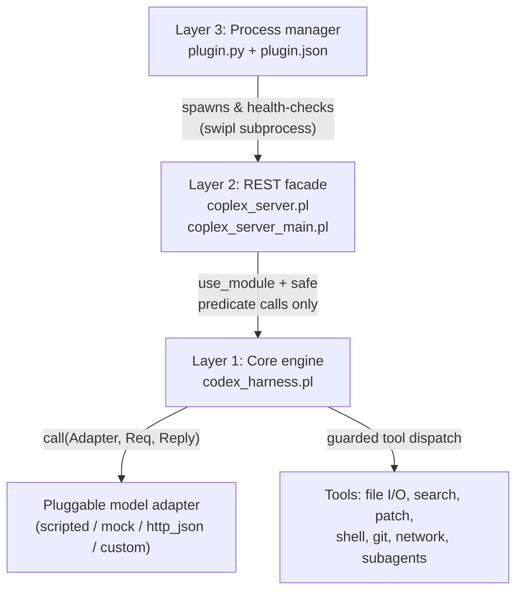
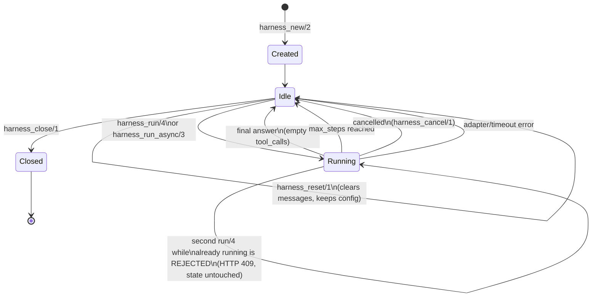

# 01 — Architecture

## Layering

`coplex` is deliberately split into three layers that only
ever talk to the layer directly below them. Nothing in
`codex_harness.pl` knows HTTP exists; nothing in
`coplex_server.pl` knows about subprocess management; `plugin.py`
never touches Prolog state directly, only the REST surface (plus a raw
`swipl` invocation for install/tests).



Why this split matters in practice:

- **Layer 1 is embeddable.** Anything that can load SWI-Prolog can
  `:- use_module(codex_harness)` and drive an agent loop directly —
  no HTTP, no subprocess, no JSON — see `example_codex_harness.pl`.
- **Layer 2 is a security boundary, not just a protocol adapter.**
  Everything arriving over the network is treated as untrusted: JSON
  bodies are mapped through a fixed allowlist before ever reaching
  `harness_new/2`, and tool names are only ever unified against a
  closed clause table. See
  [03-tools-and-permissions.md](03-tools-and-permissions.md) and
  [04-rest-api.md](04-rest-api.md) for the specifics.
- **Layer 3 doesn't need to understand Prolog at all.** It only needs
  to start a process, poll `GET /health`, and call a few REST
  endpoints — which is why it's implemented in plain Python with zero
  third-party dependencies.

## Why the REST entry point is a separate file

`coplex_server.pl` is a library: `:- use_module(coplex_server)`
never starts a server or blocks a thread, so test suites and other
tooling can load it safely. The runnable entry point lives in
`coplex_server_main.pl` instead, because SWI-Prolog's
`:- initialization(Goal, main)` directive fires whenever *that file* is
loaded — including via a plain `use_module/1` from something else, not
just when it's run as the top-level script. If the blocking
`main/1` + `block_forever` logic lived in the library file itself,
merely loading the module (e.g. from the test suite) would
silently spin up a background HTTP server and hang. Keeping the
split means:

```
swipl prolog/coplex_server_main.pl --port=8840 --host=localhost
```

...is the *only* thing that starts a server; everything else
(`test/test_codex_harness_server.pl`, `plugin.py`'s `install_after` smoke
test, a REPL session) can `use_module(coplex_server)` freely.

## State model and persistence

There is no database. A harness's entire mutable state is a single
SWI-Prolog dict, held in one dynamic fact per instance:

```prolog
:- dynamic harness_rec/3.   % harness_rec(Id, Mutex, StateDict)
```

- **Creation** (`harness_new/2`) generates a UUID `Id`, creates a
  per-instance mutex (`mutex_create(Mutex, [alias(Id)])`), and asserts
  the initial state dict.
- **All reads** (`state/2`) and **all writes** (`mutate/2`) take that
  instance's mutex for the duration of the read/retract-modify-assert
  cycle. This is what makes it safe to poll `harness_snapshot/2` from
  one thread while an async run mutates state from another (see
  [02-harness-core.md](02-harness-core.md)).
- **Destruction** (`harness_close/1`) retracts the fact and destroys
  the mutex. Nothing survives a process restart — a harness is a
  purely in-memory session object, not a durable record.
- The one optional durability mechanism is `transcript(Path)`: every
  message appended to the conversation is also appended as one JSON
  line to that file (`persist_msg/2`), independent of the in-memory
  state, so you can recover a human-readable audit trail even if the
  process is later killed.



## Concurrency model

Three distinct kinds of concurrency exist in this codebase, and it's
worth keeping them separate mentally:

1. **Per-harness mutex** (`with_mutex(Mutex, ...)` in `state/2` and
   `mutate/2`). Guarantees that reading or updating one harness's state
   dict is atomic, regardless of which thread is doing it.
2. **The run thread.** `harness_run/4` executes synchronously in
   whatever thread calls it (e.g. the HTTP worker thread handling a
   `POST /coplex/harnesses/<id>/run` request — SWI's `http_dispatch` runs
   each request on its own worker thread by default). `harness_run_async/3`
   instead marks the harness running synchronously (so the caller's
   very next state read already reflects it) and then hands the actual
   agent loop to a **detached** `thread_create/3` so the calling thread
   returns immediately. Both paths share the same timeout/error
   handling via `run_body/4` — see
   [02-harness-core.md](02-harness-core.md).
3. **Subagent worker pool.** `tool_subagents/3` runs a bounded number
   of independent child harnesses concurrently (`subagent_limit`,
   default 4), each in its own thread, coordinated through a
   `message_queue_create/1` queue rather than shared mutable state —
   see [03-tools-and-permissions.md](03-tools-and-permissions.md).

None of this requires a Git worktree or process-level isolation:
subagents get their own independent `codex_harness(Id)` (and therefore
their own mutex and state dict) but share the same repository root, so
by default they're restricted to read-only tools precisely to avoid
concurrent-write races on the filesystem (see `subagent_allow_writes`).

## Process boundary (plugin.py ↔ swipl)

The workbench never talks to Prolog directly. `plugin.py`:

1. Spawns `swipl coplex_server_main.pl --port=<P> --host=<H>`
   as a detached background process (`subprocess.Popen`, own process
   group on Windows so it isn't killed by signals meant for the
   parent).
2. Polls `GET http://<H>:<P>/health` until it answers (or a 10s
   timeout), before reporting the start as successful.
3. Persists `{pid, host, port, started_at}` to a small JSON state file
   (`.harness_server_state.json`) next to the plugin, so `status()` and
   a later `stop_server()` call (even from a different Python process
   invocation) can find and verify the running server.
4. Stops it by first asking nicely (`POST /shutdown`, which replies
   then halts the process from its own detached thread after a short
   delay) and falling back to an OS-level `SIGTERM`/`OpenProcess`-based
   check if the process doesn't exit within a timeout.

See [05-plugin-integration.md](05-plugin-integration.md) for the full
lifecycle-hook and plugin-api mapping.
