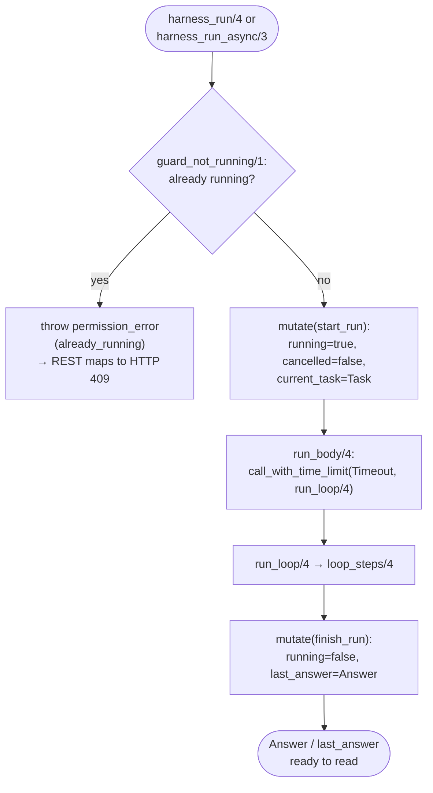
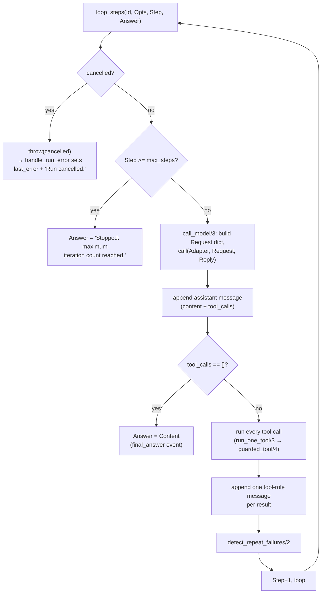

# 02 — Harness Core (`codex_harness.pl`)

## The object abstraction

Every harness is a term `codex_harness(Id)` where `Id` is a UUID. There
is no class/instance distinction in the Prolog sense — `Id` just keys
one dynamic fact:

```prolog
harness_rec(Id, Mutex, StateDict)
```

All public predicates take `codex_harness(Id)` as their first argument
and internally unwrap it to `Id` before touching `harness_rec/3`. This
indirection exists so that a future second implementation (or a
"remote handle" wrapper) could reuse the same call sites.

## State dict fields

`harness_new/2` builds the initial `StateDict` from `Options` (each
with a documented default), plus a few fields that are never
caller-settable:

| Field | Set by | Purpose |
|---|---|---|
| `id`, `adapter`, `model` | options | Identity + which model-adapter goal to call. |
| `instructions`, `extra_instructions` | options | Concatenated into the system prompt every model call (`build_instructions/2`). |
| `root`, `cwd` | options | `root` fences every path-safety check; `cwd` is where subprocesses run. |
| `messages` | runtime | Full conversation history (user/assistant/tool/system messages), returned by `harness_messages/2`. |
| `cancelled`, `running` | runtime | Cooperative-cancel flag and in-flight flag — see lifecycle below. |
| `current_task`, `iteration` | runtime | What's running now and which loop step it's on. |
| `last_answer`, `last_error` | runtime | Outcome of the most recent run. |
| `tool_activity` | runtime | Every tool result ever recorded (`record_tool/2`), independent of `messages`. |
| `subagents` | *(declared, not populated by tools today)* | Reserved for future subagent bookkeeping. |
| `max_steps`, `timeout`, `command_timeout` | options | Loop iteration cap, overall run wall-clock budget, per-subprocess budget. |
| `max_output_bytes`, `max_download_bytes` | options | Truncation ceilings for tool output / downloaded bytes. |
| `allow_shell`, `allow_network`, `allow_shell_string` | options | Capability gates (`allow_shell_string` is reserved/unused — no string-shell tool exists yet). |
| `allowed_hosts`, `writable_paths`, `readable_paths` | options | Extra allowlists layered on top of the mandatory repo-root fence. |
| `subagent_limit`, `subagent_allow_writes` | options | Bounds the child-harness worker pool. |
| `approval`, `on_event` | options | Goal-shaped hooks — **in-process only**, never settable from REST JSON. |
| `approval_mode`, `approval_timeout` | options | Closed-enum (`none`/`interactive`/`deny_risky`) approval gate + its pause deadline in seconds — REST-safe, layered *underneath* `approval(Goal)` (only applies when no `approval(Goal)` hook is set). See `docs/03-tools-and-permissions.md`'s permission-model diagram and `docs/04-rest-api.md`'s "Interactive approvals" section. |
| `transcript` | options | Optional JSONL audit-log path. |
| `secrets` | options | Strings to redact (`***`) from every emitted event/tool result. |
| `default_test_command`, `mock_script`, `web_search_backend` | options | Behavioral knobs for `run_tests`, the scripted adapter, and `web_search`. |
| `fail_signatures`, `call_seq` | runtime | Repeat-failure detection bookkeeping (see below). |
| `parent` | options | Set by the subagent spawner so a child harness can be traced back to its parent's `Id`. |
| `allowed_tools` | options | `all` or an explicit tool-name list — the first permission gate every tool call passes through. |
| `created_at` | runtime | Unix timestamp from `get_time/1`, set once at creation; surfaced in both `harness_snapshot/2` and `harness_summary/2` for UI sorting. |

## Public predicate summary

| Predicate | Blocks caller? | Role |
|---|---|---|
| `harness_new(+Options, -Harness)` | no | Create an instance. |
| `harness_close(+Harness)` | no | Destroy instance + its mutex. |
| `harness_run(+H, +Task, -Answer)` / `/4` with `RunOptions` | **yes**, until done/timeout/cancelled | Run the agent loop to completion. |
| `harness_run_async(+H, +Task, +RunOptions)` | no — returns once `running` flips true | Same loop, executed in a detached thread. |
| `harness_cancel(+H)` | no | Cooperative cancel flag; only takes effect *during* a run. |
| `harness_reset(+H)` | no | Clears conversation/messages/errors, keeps config. |
| `harness_messages(+H, -Msgs)` | no | Full conversation history. |
| `harness_snapshot(+H, -Dict)` | no | Full observation surface (adds `created_at` and `pending_approvals` -- one `{call_id, tool, risk, arguments, requested_at}` dict per call currently paused by `approval_mode(interactive)` -- to the fields above). |
| `harness_summary(+H, -Dict)` | no | Lighter observation surface for list views — message/tool-call *counts* (including `pending_approval_count`) instead of full histories. |
| `harness_tool(+H, +Name, +Args, -Result)` | depends on tool | Invoke one tool directly, bypassing the model loop. |
| `harness_tool_specs(-Specs)` | no | Static tool catalog (name/risk/description/schema). |
| `harness_list(-Ids)` | no | All currently live harness ids. |
| `harness_decide_approval(+H, +CallId, +Decision)` | no | Resolve a call paused by `approval_mode(interactive)` (`Decision` is `allow` or `deny`); throws `existence_error(pending_approval, CallId)` if nothing with that id is currently pending. See `docs/03-tools-and-permissions.md`. |

## The agent loop

`harness_run/4` (and `harness_run_async/3`) both funnel into the same
three-stage pipeline:



`run_loop/4` builds the initial user message (task text + gathered
repository context — see below), then hands off to `loop_steps/4`,
which is the actual step machine:



Key points:

- **One model call per step**, and *all* tool calls the model returned
  in that step are executed (via `maplist/3`) before looping again —
  the model can request several tool calls in parallel per turn, but
  the loop itself is strictly sequential across turns.
- **Cancellation is cooperative**, checked only at the top of each
  `loop_steps/4` iteration (`check_cancelled/1` is also called inside
  `guarded_tool/4` before every tool dispatch). `harness_cancel/1`
  before a run has no effect — the very next `start_run` mutation
  resets `cancelled` to `false`.
- **Errors are normalized, never propagated raw.** `run_body/4` wraps
  the whole loop in `call_with_time_limit/2` and a `catch/3`;
  `handle_run_error/3` maps `time_limit_exceeded` and `cancelled` to
  specific `last_error.type` values plus a human-readable `Answer`
  string, and anything else becomes a generic `harness_error`.

### Sync vs. async: why both exist and how they share code

`harness_run/4` blocks the calling thread for the entire run — fine
for a script or a CLI, awkward for a REST client (especially a
browser) that doesn't want to hold a connection open for up to
`timeout` seconds. `harness_run_async/3` exists purely to fix that:

```prolog
harness_run_async(codex_harness(Id), Task, RunOptions) :-
    must_be(list, RunOptions),
    guard_not_running(Id),
    mutate(Id, start_run(Task)),
    thread_create(
        ( run_body(Id, Task, RunOptions, Answer),
          mutate(Id, finish_run(Answer))
        ),
        _,
        [detached(true)]).
```

Both entry points call the same `guard_not_running/1` +
`start_run`/`run_body/4`/`finish_run` sequence; the only difference is
*which thread* executes `run_body/4`. Because `mutate(Id,
start_run(Task))` happens **before** `thread_create/3` returns, a
caller that immediately reads `harness_snapshot/2` right after
`harness_run_async/3` returns is guaranteed to see `running == true` —
there's no window where the async call has "returned" but the harness
still looks idle. `guard_not_running/1` (shared by both entry points)
throws `error(permission_error(start, harness_run, already_running), _)`
if a run is already in flight, which the REST layer
(`error_status/2` in `coplex_server.pl`) maps to HTTP 409 —
this is what makes it safe for a UI's "Run" button to be double-clicked
without corrupting shared state.

## Model adapters

The harness never talks to a specific LLM provider directly — it calls
whatever goal `adapter(Adapter)` names:

```prolog
call(Adapter, RequestDict, ReplyDict)
```

Request (built by `call_model/3`):

```prolog
_{ model:Model, instructions:Instructions, messages:Messages,
   tools:ToolSpecs, options:RunOptions }
```

Reply (post `normalize_reply/2`, tolerant of loose JSON shapes —
missing keys default sensibly, non-dict tool-call entries are
coerced):

```prolog
_{ content:"assistant text",
   tool_calls:[ _{id:"...", name:read_file, arguments:_{path:"..."}} ] }
```

An empty `tool_calls` list is what ends the loop with a final answer.

Built-in adapters:

- **`scripted` / `mock`** (`scripted_adapter/3`) — pops one entry at a
  time off `mock_script` (the `mock_replies` option), mutex-protected
  the same way any other state mutation is. This is what every plunit
  test and the REST test suite uses: fully deterministic, no network,
  no live model. `wrap_adapter/3` normalizes both the atoms `scripted`
  and `mock` (and an already-wrapped `scripted_adapter(_)` term) to
  `scripted_adapter(Id)`; anything else passes through untouched, so a
  real provider adapter needs zero core-module changes to register.
- **`openai` (`openai_chat_adapter/3`)** — a complete translation
  adapter for OpenAI-compatible Chat Completions APIs (OpenAI itself,
  Azure OpenAI, or a self-hosted server speaking the same wire format
  -- vLLM, Ollama's `/v1` shim, LM Studio, ...): builds the request
  body (system/user/assistant/tool messages, `tools` in the
  `{type:"function", function:{name,description,parameters}}` shape),
  POSTs it to the `adapter_url` option with
  `Authorization: Bearer <adapter_api_key>`, and translates the reply
  back through `normalize_reply/2`. Gated by `allow_network` like the
  web tools; `validate_adapter_url/2` still enforces `allowed_hosts`
  but deliberately does *not* block loopback/private-range hosts,
  since `adapter_url` is trusted config, not model-controlled input --
  see `FEATURE_GUIDE.md` §1 for the full security rationale (including
  why the API key lives in harness state here, unlike the advice for a
  fully custom adapter below).
- **`http_json_adapter(Url, Request, Reply)`** — a documented skeleton:
  POSTs the normalized request as JSON via `library(http/http_client)`
  and expects `{content, tool_calls}` JSON back. A provider that
  doesn't already speak this harness's own wire format (or the
  `openai` adapter's OpenAI-compatible one above) needs a small
  translation adapter of its own — see `FEATURE_GUIDE.md` §1 for the
  recommended pattern.

## Repository context gathering

Before the first model call of a run, `gather_context/3` assembles a
bounded text blob (`format(string(...))`, truncated to
`min(8000, max_output_bytes)`) containing: repo root/cwd, OS, SWI
version, current git branch + `git status --porcelain`, a shallow
top-level directory listing (capped at 40 entries), the contents of
any `AGENTS.md`/`agents.md` (root, `.github/`, or `docs/`), which
well-known config files exist (`package.json`, `pyproject.toml`,
`Cargo.toml`, ...), and any caller-supplied `context(Extra)` run
option. This is prepended to the task text in the first user message
so the model doesn't have to spend a tool call just to orient itself.

## Repeat-failure detection

After every step's tool results are recorded, `detect_repeat_failures/2`
computes a `sig(Tool, ErrorType)` signature for each failed result and
appends it to `fail_signatures`. If any signature has now occurred 3+
times across the whole run, a `system`-role message is injected —
*"Repeated identical tool failure detected; stop retrying the same
call."* — nudging the model to change strategy instead of looping
forever on, say, a permission-denied write. This is pure bookkeeping;
it doesn't stop the loop itself, it only steers the model's next turn.

## Events, redaction, and the transcript

Every significant moment (`run_start`, `model_request`,
`model_response`, `tool_start`, `tool_finish`, `final_answer`, `error`)
is passed through `emit/2`, which:

1. Runs the event through `redact_result/3` — a substring-replace pass
   over the event's string form for every value in `secrets`, turning
   any occurrence into `***` before it's ever logged or forwarded.
2. Logs it under the `codex_harness` debug topic
   (`debug(codex_harness, '~w', [Safe])`) — enable with
   `?- debug(codex_harness).`
3. Calls the caller-supplied `on_event(Goal)` hook, if any, wrapped in
   its own `catch/3` so a misbehaving callback can never break a run —
   but the failure is now logged (not silently swallowed) so a
   wrong-module callback goal doesn't fail invisibly (see
   `FEATURE_GUIDE.md`'s pitfall list for the exact failure mode this
   fixed).

Separately, every message appended to the conversation
(`apply_mut(add_message(M), ...)`) is also passed to `persist_msg/2`,
which — only if `transcript(Path)` was set — appends one JSON line
(`{..., ts:UnixTime}`) to that file. This is independent of the
in-memory `messages` list and survives even if the process is killed
mid-run.

## Disk persistence (surviving a restart)

Distinct from, and always-on unlike, the opt-in `transcript` above:
every `mutate/2` call — not just new messages — rewrites this
harness's *entire* current state to one JSON file,
`<coplex_state_dir>/<id>.json` (`persist_state/1`), replacing whatever
was there before. A full-snapshot rewrite rather than an
incremental/JSONL append keeps `rehydrate_harnesses/0` trivial: read
one file, done, no replay logic. `coplex_state_dir/1` defaults to
`./runtime/harnesses` (resolved relative to the process's current
directory — `plugin.py` always launches `swipl` with this plugin's own
directory as cwd), overridable via the `COPLEX_STATE_DIR` environment
variable or, for tests, `set_coplex_state_dir/1` (both test files
redirect this to an isolated temp directory at load time so a test run
never touches the real production directory). A write failure (disk
full, permission denied, ...) is caught and merely logged — persistence
is a best-effort durability layer, never a correctness dependency of
the agent loop that triggered it. `harness_close/1` deletes the file,
so a destroyed harness doesn't reappear on the next restart.

`rehydrate_harnesses/0` scans that directory and re-asserts a
`harness_rec/3` (with a fresh mutex — mutexes don't survive a process
restart either) for each `<id>.json` it finds, skipping any id already
live and logging (not raising) a problem with any individual file so
one corrupt snapshot can't block every other harness coming back.
It's called exactly once, by `server_start/2`, *before* the HTTP
listener starts — never automatically on module load, since
`codex_harness.pl` is a plain library usable with no server at all
(see the module docstring), and auto-rehydrating on load would mean a
test suite merely `use_module`-ing this file could pick up, and start
writing into, the real production runtime directory.

Not every field round-trips — some are deliberately excluded from the
JSON and reset to a safe default on rehydration instead:

| Field(s) | On disk | After rehydration |
|---|---|---|
| `adapter_api_key`, `secrets` | never written (may hold a live plaintext secret) | `""` / `[]` |
| `approval`, `on_event`, `web_search_backend` | never written (goal-shaped, in-process only) | `none` |
| `adapter` | never written (a *wrapped* closure, e.g. `scripted_adapter(Id)`, not plain data) | re-derived from the persisted `adapter_kind` via `wrap_adapter/3` |
| `adapter_kind` | the pre-`wrap_adapter/3` selector (`scripted`/`mock`/`openai`) | restored verbatim, unless the original was a custom in-process adapter closure, which persists as a safe `scripted` fallback |
| `fail_signatures`, `call_seq`, `subagents` | never written (pure in-run bookkeeping) | their `harness_new/2` defaults (`[]`, `0`, `[]`) |
| `running` | whatever it was at the last mutate/2 | forced `false`; if it *was* `true`, `last_error` is overwritten to say the run was interrupted by a restart (the thread that ran it is gone — only its history is recoverable) |
| everything else — `messages`, `tool_activity`, `current_task`, `last_answer`, `last_error` (when `running` wasn't `true`), every capability flag/allowlist, `approval_mode`/`approval_timeout`, `root`/`cwd`/`model`/`instructions`, `created_at`, ... | written verbatim | restored verbatim |

A pending approval (`approval_mode(interactive)`) does **not** survive
a restart — there's no way to safely resume a thread waiting on a REST
decision across a real process boundary, so it's simply gone (its
`pending_approval_rec/3` fact was never persisted in the first place;
see `docs/03-tools-and-permissions.md`).

One subtlety worth knowing if you touch this code: `json_read_dict/3`
decodes JSON string values as Prolog *strings* by default, but this
codebase represents sentinel/enum values (`none`, `all`, `auto`, tool
names) as *atoms* everywhere, and checks them with plain `==/2`
(`S.allowed_tools == all`, `S.transcript == none`, ...) — a naive
rehydration would read those back as same-text but different-typed
*strings*, silently breaking every such check (denying every tool,
mistreating a real path as the literal name "none", ...).
`rehydrate_harnesses/0` reads with `json_read_dict(In, Dict,
[value_string_as(atom)])` instead, which decodes every string
(including genuine free text like message content) as an atom — safe
here since every text predicate this codebase actually uses accepts
atoms and strings interchangeably as input. See `FEATURE_GUIDE.md`'s
pitfall list for the fuller writeup.


