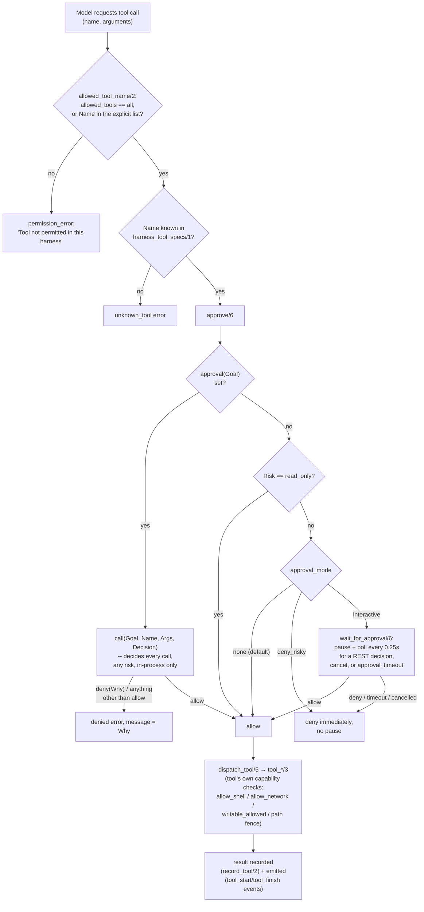
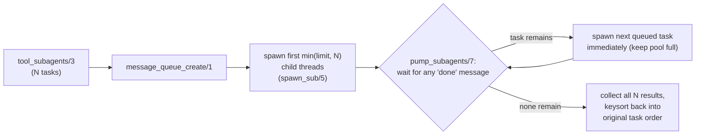

# 03 — Tools and the Permission Model

## Tool catalog

`harness_tool_specs/1` is the single source of truth for what tools
exist, both for the model (via `call_model/3` → `public_spec/2`) and
for the REST `/tools` endpoint. Every tool ultimately dispatches
through one fixed clause table, `dispatch_tool/5`:

| Tool | Risk label | What it does | Gate enforced by |
|---|---|---|---|
| `read_file` | read_only | Read a UTF-8 file under the repo root, with `offset`/`limit` line slicing. | path fence only |
| `write_file` | write | Atomically create/replace a UTF-8 file. | path fence + `writable_paths` |
| `list_files` | read_only | Recursively list files under a relative directory (capped, default 200 / max 2000). | path fence only |
| `search` | read_only | Content search — uses `rg` (ripgrep) if on `PATH`, else a pure-Prolog line-scan fallback. | path fence only |
| `apply_patch` | write | Apply a unified diff, all-or-nothing across every hunk in every file. | path fence + `writable_paths` |
| `file_info` | read_only | Size/type/mtime of a path. | path fence only |
| `make_directory` | write | Create a directory (and parents). | path fence + `writable_paths` |
| `shell` | process | Run an explicit program + argv list (no shell string interpretation). | `allow_shell` |
| `run_tests` | process | Run the (auto-detected or configured) test command. | `allow_shell` only gates an explicit override — see below |
| `git_status` / `git_diff` / `git_log` / `git_show` | read_only | Read-only `git` subcommands via `exec_program/7`. | none beyond repo cwd |
| `web_search` | network | Calls an injected `web_search_backend(Goal)`. | `allow_network` |
| `web_get` | network | HTTP(S) GET of an allowed URL. | `allow_network` + SSRF guard |
| `download` | network | HTTP(S) GET written to a path under the repo. | `allow_network` + SSRF guard + `writable_paths` + size cap |
| `subagents` | process | Run independent analysis tasks concurrently in child harnesses. | `subagent_limit`, default read-only children |

**Important nuance:** the "risk label" in the table above (`read_only`
/ `write` / `process` / `network`) is descriptive metadata surfaced to
the model and to REST clients — it is *not itself* an enforcement
mechanism. `dispatch_tool/5`'s second argument always unifies with
whatever `Risk` came straight out of `harness_tool_specs/1` for that
tool name, so it can never mismatch. The actual gating happens inside
each `tool_*` predicate, which checks the relevant capability flag
itself (`S.allow_shell`, `S.allow_network`, `writable_allowed/2`, ...).

## Layered permission model

Every tool call passes through the same funnel before it can do
anything, in this order:

Three independent knobs, all must pass, plus per-tool self-checks:

1. **`allowed_tools`** (harness-level allowlist) — coarsest gate,
   checked first, purely by tool name.
2. **`approval(Goal)`** (harness-level hook) — if set,
   `call(Goal, Name, Args, Decision)` decides `allow` or `deny(Why)`
   *per call*, for every risk level, with full visibility into the
   arguments. In-process only, never settable from REST JSON (see
   `docs/04-rest-api.md`'s security model) — this is the hook you'd
   wire up to a human-in-the-loop confirmation from Prolog code
   itself.
3. **`approval_mode`** (harness-level enum, `none`/`interactive`/
   `deny_risky`) — a second, REST-safe gate that only ever applies
   when no `approval(Goal)` hook is configured, and never touches
   `read_only`-risk calls regardless of mode. `interactive` pauses a
   non-`read_only` call (`wait_for_approval/6`) until
   `POST /coplex/harnesses/<id>/approvals/<call_id>` resolves it, a
   cancel/close denies it, or `approval_timeout` elapses (auto-deny);
   `deny_risky` denies the same calls immediately, with no pause. See
   `docs/04-rest-api.md`'s "Interactive approvals" section for the
   full REST-facing picture, and `FEATURE_GUIDE.md` §2 for
   implementation notes (the pending-approval registry, the SWI dict/
   `findall` gotcha it ran into, and the atom/string `call_id` pitfall).
4. **Per-tool capability flags** — `allow_shell`, `allow_network`, and
   the path-safety functions below — checked *inside* the specific
   `tool_*` predicate, independent of the gates above. A tool can pass
   `allowed_tools`, `approval`, and `approval_mode` and still be
   refused here.

## Path safety

Every tool that touches the filesystem resolves its path through
`safe_resolve/3`, which:

1. Treats an absolute path as-is, otherwise joins it onto `root`.
2. Canonicalizes it (`absolute_file_name/3` with `access(none)`, so it
   doesn't require the file to already exist).
3. Calls `path_allowed/2`, which requires the canonical path to be
   `under_root(root, Abs)` **and**, if `readable_paths` is non-empty,
   also under at least one of those (this is an *additional*
   allowlist layered on top of the root fence, not a replacement for
   it — `readable_paths` cannot be used to escape `root`).
4. Throws `permission_error(access, file, Rel)` if either check fails.

`writable_allowed/2` mirrors this for the `writable_paths` allowlist
and is checked separately (and *in addition to* `safe_resolve/3`) by
every write-class tool (`write_file`, `apply_patch`, `make_directory`,
`download`).

`under_root/2` is symlink- and case-safety-aware: it prefers
`same_file/2` (so an OS-junction/symlink that ultimately resolves to
the same file is accepted) and falls back to a plain string-prefix
check with a path-separator boundary (so `.../root-evil` is never
mistaken for a child of `.../root`); on Windows, both sides are
lower-cased first since NTFS paths are case-insensitive.

## Shell and process execution

`tool_shell/3` requires `allow_shell(true)` and executes via
`process_create/3` with an **explicit argv list** — there is never a
`/bin/sh -c "..."` string-interpretation path, so shell metacharacter
injection through `command`/`args` isn't a concern the way it would be
with a naive `system/1` call.

`tool_run_tests/3` auto-detects a runner (`default_test_command` if
configured as a list, else `pytest`/`npm test`/`cargo test`/a bare
`swipl -g run_tests -t halt` based on which project files exist — see
`detect_tests/3`). **An explicit `command`/`args` override in the tool
call is only honored when `allow_shell(true)` is also set** —
otherwise it's silently ignored in favor of the auto-detected command.
This was a deliberately-fixed vulnerability: without that check,
`run_tests` was a full arbitrary-command-execution bypass of
`tool_shell`'s own permission gate (see `FEATURE_GUIDE.md`'s pitfall
log, fixed 2026-08-26, regression-tested by
`run_tests_ignores_override_without_shell`).

All subprocess execution funnels through `exec_program/7`, which
handles:

- `cwd(S.cwd)`, plus `window(false)` on Windows (a visible console
  window would otherwise flash per subprocess).
- **Output draining on separate threads.** Both stdout and stderr are
  read on their own `thread_create/3` (`read_pipe/1` + `join_pipe/2`)
  concurrently with `process_wait/3` — reading a live pipe
  synchronously in the main thread can deadlock on Windows once the
  child's output buffer fills up, so this isn't optional.
- **Timeout enforcement** (`process_wait(PID, Status, [timeout(Timeout)])`),
  falling back to `process_kill/1` and a status of `timeout` if it
  fires.
- **Output truncation** to `max_output_bytes` on both streams
  independently, each flagged `truncated:true`/`false`.
- **Cancellation check** (`check_cancelled/1`) before the process even
  starts.

## Network access and SSRF protection

`allow_network(true)` gates all three network tools
(`require_network/3`); when it's false they return a
`permission_error` immediately, no host resolution attempted at all.
When network access is allowed, every URL still passes through
`http_fetch/4`'s guard before any request is made:

1. **Scheme allowlist** — only `http`/`https`; anything else (e.g.
   `file:`, `ftp:`) is rejected outright.
2. **Host allowlist** (`allowed_hosts`) — if non-empty, the host must
   be an exact match; empty means "any host not otherwise blocked".
3. **`unsafe_host/1` blocklist**, checked regardless of the allowlist
   above:
   - Loopback literals (`localhost`, `127.0.0.1`, `::1`, `0.0.0.0`)
     and the whole `127.0.0.0/8` range.
   - RFC1918 private ranges: `10.0.0.0/8`, `192.168.0.0/16`, and
     `172.16.0.0/12` (checked via the second-octet range 16–31, not
     just a literal `172.16.` prefix, so the whole `/12` is actually
     covered).
   - Link-local `169.254.0.0/16`.
   - IPv6 unique-local (`fc00::/7`) and link-local (`fe80::/10`)
     *literals* — gated on the host containing `:` first, so an
     ordinary hostname like `fcbank.example.com` is never
     false-positived into looking like an IPv6 literal.
4. **No redirects** (`redirect(false)` on `http_open/3`) — a request
   can't be allowlisted for host A and then silently redirected to
   host B.
5. **Size limits** — `http_open/3`'s own `size_limit(max_download_bytes)`
   during the fetch, plus (for `download` specifically) an explicit
   post-fetch length check against `max_download_bytes` before the
   bytes are ever written to disk.

`download` additionally routes its destination path through the same
`safe_resolve/3` + `writable_allowed/2` checks as any other write tool
— network access being enabled does not relax the filesystem fence.

**`openai_chat_adapter/3` does *not* reuse this exact guard.** Its own
`validate_adapter_url/2` still enforces the scheme allowlist and
`allowed_hosts`, but deliberately skips step 3 (the loopback/private-
range blocklist): `adapter_url` is trusted, operator-supplied
configuration fixed at harness-creation time — like `root`/`cwd` — not
task/model-controlled input the way a tool's `url` argument is, and a
locally-hosted model server (Ollama, vLLM, LM Studio, an internal
gateway) on a loopback or private address is a completely ordinary,
legitimate value for it. Blocking it there would rule out one of the
most common real deployments of a "real LLM adapter" for no actual
security benefit, since nothing untrusted ever gets to choose that URL.

## `apply_patch`: unified-diff handling

`tool_apply_patch/3` parses a standard unified diff (`---`/`+++`/`@@`
headers, `patch_files//1` DCG) into per-file hunks, then:

1. **Validates every file's path** (`validate_patch_path/2` —
   `safe_resolve/3` + `writable_allowed/2`) *before* touching any file.
2. **Previews every hunk** against the current file contents
   (`preview_one_file/3`) without writing anything.
3. Only if **every** file's hunks apply cleanly does it commit any of
   them (`commit_preview/3`, via the same atomic
   temp-file-then-rename `atomic_write/2` used by `write_file`) — a
   patch that fails partway through never leaves the repo in a
   half-applied state.

This does not (yet) understand git's extended headers (`diff --git`,
`rename from/to`, binary-file markers) — see `FEATURE_GUIDE.md` §5 for
the recommended hardening path if that's ever needed.

## Subagents

`subagents` lets the model fan a task list out to independent child
harnesses running concurrently, bounded by `subagent_limit` (default
4):

Each child is a genuinely separate `codex_harness(ChildId)` — its own
UUID, its own mutex, its own state dict — created via `run_one_sub/3`
with:

- `parent(S.id)` set, so it's traceable back to its creator.
- `allow_shell(false)`, `allow_network(false)` — children never
  inherit the parent's shell/network capabilities.
- `allowed_tools` restricted to a **read-only default**
  (`child_tools/2`: `read_file`, `list_files`, `search`, `file_info`,
  the four read-only git tools) *unless* the parent set
  `subagent_allow_writes(true)`, in which case children get `all`.
  This default exists specifically to avoid concurrent-write races on
  a shared filesystem without requiring a Git worktree per child.
- `max_steps(8)`, `timeout(30)` — deliberately tight, since these are
  meant for bounded analysis tasks, not open-ended agent runs.
- The same `adapter` and `mock_replies` as the parent, so scripted
  tests can drive subagents deterministically too.

Coordination uses a `message_queue_create/1` queue rather than shared
mutable state: each child thread sends `done(Index, Result, ThreadId)`
when finished, the pump loop replaces it with a new task from the tail
of the list (keeping the worker pool saturated until the task list is
exhausted), and results are `keysort/2`-ed back into original
submission order before being returned — so the caller sees results in
task order even though completion order is nondeterministic.
