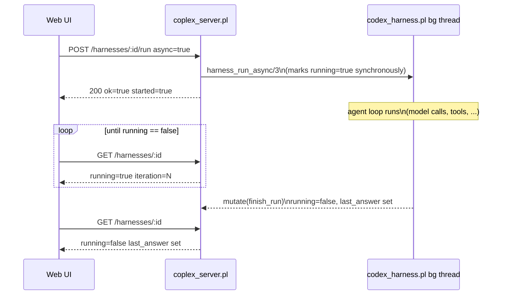

# 04 — REST API (`coplex_server.pl`)

## Purpose

`coplex_server.pl` exposes every public `codex_harness.pl`
predicate as JSON-in/JSON-out HTTP endpoints, so a host process — or a
browser-based web UI — can create, drive, observe, and tear down
harness instances without embedding SWI-Prolog. It is a **plain
library**: `:- use_module(coplex_server)` never starts a server.
The runnable entry point is the sibling file
`coplex_server_main.pl` (see
[01-architecture.md](01-architecture.md) for why they're split):

```
swipl coplex_server_main.pl --port=8840 --host=localhost
```

## Endpoint reference

| Method | Path | Core predicate | Notes |
|---|---|---|---|
| GET | `/health` | — | Liveness check: `{"ok":true,"service":"coplex"}`. |
| GET | `/tools` | `harness_tool_specs/1` | Static tool catalog. |
| GET | `/harnesses` | `harness_list/1` + `harness_summary/2` | Returns **both** `ids` (plain list) and `harnesses` (array of lightweight status dicts). |
| POST | `/harnesses` | `harness_new/2` | Body is a JSON object of options; only the safe allowlist (below) is honored. |
| GET | `/harnesses/<id>` | `harness_snapshot/2` | Full detail: config-independent status plus complete `messages`/`tool_activity` history. |
| DELETE | `/harnesses/<id>` | `harness_close/1` | Destroys the instance. |
| POST | `/harnesses/<id>/run` | `harness_run/4` or `harness_run_async/3` | Body: `{"task": "...", "context"?: "...", "async"?: true}`. |
| POST | `/harnesses/<id>/cancel` | `harness_cancel/1` | Cooperative — only affects an in-flight run. |
| POST | `/harnesses/<id>/reset` | `harness_reset/1` | Clears conversation, keeps configuration. |
| GET | `/harnesses/<id>/messages` | `harness_messages/2` | Full conversation array. |
| POST | `/harnesses/<id>/tools/<name>` | `harness_tool/4` | Body is the tool's own argument object; bypasses the model loop entirely. |
| POST | `/shutdown` | — | Replies `{"ok":true,...}` then halts the process from a detached thread ~0.2s later. |

### Status codes

| Code | When |
|---|---|
| 200 | Success. |
| 404 | Unknown/nonexistent harness id, or an unmatched route under `/harnesses/`. |
| 409 | `POST .../run` while that harness is already running (`guard_not_running/1`'s `already_running` permission error). |
| 500 | Any other internal error, `{"ok": false, "error": "<message string>"}`. |

Every status/error mapping funnels through one shared predicate,
`error_status/2`, used by both `with_existing_harness/2` and
`with_json_body/3` — so a caught error gets the same HTTP code
regardless of which helper happened to catch it first.

## Designing a UI around this API

This is the part of the surface that exists specifically so a
management UI (web-based or otherwise) has something ergonomic to
drive, rather than just a literal HTTP transliteration of the Prolog
API.

### Non-blocking runs

`POST /harnesses/<id>/run` blocks the HTTP connection until the agent
loop finishes by default — fine for a script, a bad fit for a browser
UI that wants to show live progress. Pass `{"async": true}` instead:

```http
POST /harnesses/<id>/run
Content-Type: application/json

{"task": "Add a health check endpoint", "async": true}
```

```json
{"ok": true, "id": "<id>", "started": true, "async": true}
```

The reply comes back essentially immediately (the harness is already
marked `running` by the time this reply is sent — see
[02-harness-core.md](02-harness-core.md)'s async section), and the run
continues in a background thread. A UI then polls either endpoint
below until `running` flips back to `false`, then reads
`last_answer` / `last_error`:



A second `run` request against a harness that's already running is
rejected with **HTTP 409** rather than starting a concurrent run on
shared state — this is what makes it safe for a UI's "Run" button to
be double-clicked or for a naive retry to be attempted without
corrupting anything.

### Dashboard-friendly listing

`GET /harnesses` returns both the original plain `ids` array (for
backward compatibility) and a `harnesses` array of `harness_summary/2`
dicts:

```json
{
  "ok": true,
  "ids": ["a1b2...", "c3d4..."],
  "harnesses": [
    {
      "id": "a1b2...", "current_task": "Add a health check endpoint",
      "iteration": 3, "running": true, "cancelled": false,
      "last_answer": "", "last_error": null,
      "message_count": 7, "tool_call_count": 2,
      "created_at": 1755000000.123
    }
  ]
}
```

This is deliberately *not* the same shape as `GET /harnesses/<id>`
(`harness_snapshot/2`), which additionally includes the complete
`messages` and `tool_activity` arrays — a list view for N harnesses
should cost O(1) requests and a small, bounded payload per row; a
detail view for one harness can afford to be complete.

### CORS

`library(http/http_cors)` is wired in and enabled for **any origin**
by default (`Access-Control-Allow-Origin: *`), including responding to
the `OPTIONS` preflight every browser sends before a cross-origin
`POST`/`DELETE`. Every route explicitly handles the `options` method
with `cors_enable/2` + a terminating `format('~n')` (an empty 200
body — this is required; without it the connection is closed
mid-response and the browser's preflight fails). This means a UI
served from a different origin or dev-server port (Vite, webpack-dev-
server, ...) can call this API directly with **no reverse proxy**.

Configure via `COPLEX_CORS_ORIGIN`:

| Value | Effect |
|---|---|
| unset (default) | `*` — any origin. |
| `""` (empty string) | CORS disabled entirely (`http:cors` setting `[]`). |
| `https://a.example,https://b.example` | Only those origins (comma-separated, parsed by `configure_cors/0` at module load). |

This default is safe *specifically because* the server binds to
`localhost` only by default (see below) — a page loaded from a remote
origin can still reach a `localhost`-bound server through a visiting
user's own browser, so CORS-wildcard + localhost-bind is a deliberate,
documented pairing, not an oversight. If the bind host is ever changed
away from `localhost`, tighten `COPLEX_CORS_ORIGIN` too.

## Security model (request-body handling)

The one invariant that matters most here: **a request body is never
parsed as Prolog source, and never used to construct a callable
term.**

- **`POST /harnesses` option filtering.** `dict_options/2` maps the
  incoming JSON dict through `safe_pair_option/2`, which only keeps
  keys present in the fixed `safe_option_key/1` fact table (`root`,
  `cwd`, `model`, `instructions`, `allow_shell`, `allow_network`,
  `allowed_hosts`, `writable_paths`, `readable_paths`,
  `max_output_bytes`, `max_download_bytes`, `timeout`,
  `command_timeout`, `max_steps`, `subagent_limit`,
  `subagent_allow_writes`, `transcript`, `secrets`,
  `default_test_command`, `mock_replies`, `allowed_tools`, `adapter`).
  Anything else is silently dropped, not errored — a client sending
  extra keys still succeeds.
- **`adapter` is normalized, not passed through.** `sanitize_value/3`
  maps the incoming value to the atom `mock` (if it's literally
  `"mock"`/`mock`) or `scripted` for anything else — a JSON body can
  never select an arbitrary in-process adapter goal.
- **`approval`, `on_event`, `parent`, and `web_search_backend` are
  never accepted from JSON at all** — they're simply absent from
  `safe_option_key/1`. This matters because `codex_harness.pl`
  eventually `call/N`'s each of these as a goal
  (`call(Approval, ...)`, `call(OnEvent, ...)`, `call(Backend, ...)`);
  accepting an attacker-controlled string for any of them would be a
  remote-code-execution vector. There is a dedicated regression test
  for this (`goal_shaped_options_are_ignored` in
  `test/test_codex_harness_server.pl`) that posts
  `{"approval": "shell(rm)", ...}` and asserts creation still succeeds
  with the value simply dropped.
- **Tool names on `POST /harnesses/<id>/tools/<name>` are only ever
  unified against `dispatch_tool/5`'s fixed clause table** (in
  `codex_harness.pl`) — an unknown or attacker-chosen name can never
  resolve to an arbitrary predicate; it falls through to the
  `unknown_tool` error clause instead.
- **The server binds to `localhost` by default.** Pass a different
  `--host` (or set `COPLEX_HOST`) only if the host process
  genuinely runs in a different network namespace from this plugin.

## Example session

```bash
# Create a harness against the current repo, scripted adapter for a deterministic demo
curl -s -X POST http://localhost:8840/harnesses \
  -H 'Content-Type: application/json' \
  -d '{"root": ".", "adapter": "scripted",
       "mock_replies": [{"content": "hi from curl", "tool_calls": []}]}'
# => {"ok":true,"id":"3f9a..."}

# Kick off a run, non-blocking
curl -s -X POST http://localhost:8840/harnesses/3f9a.../run \
  -H 'Content-Type: application/json' \
  -d '{"task": "say hi", "async": true}'
# => {"ok":true,"id":"3f9a...","started":true,"async":true}

# Poll status
curl -s http://localhost:8840/harnesses/3f9a...
# => {"ok":true,...,"running":false,"last_answer":"hi from curl",...}

# Read the conversation
curl -s http://localhost:8840/harnesses/3f9a.../messages

# Clean up
curl -s -X DELETE http://localhost:8840/harnesses/3f9a...
```

## Tests

`test/test_codex_harness_server.pl` drives all of the above end-to-end over
real HTTP against a server started on an ephemeral localhost port —
see [06-testing.md](06-testing.md) for the full breakdown.
