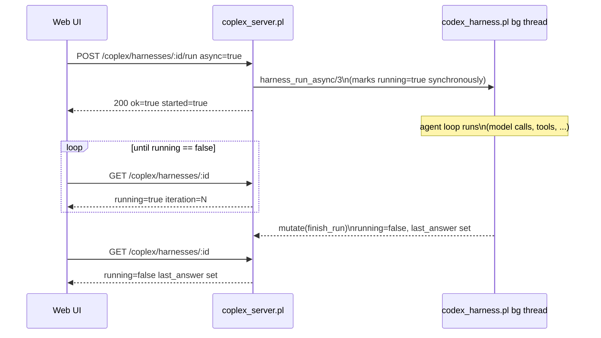

# 04 — REST API (`coplex_server.pl`)

## Purpose

`coplex_server.pl` exposes every public `codex_harness.pl`
predicate as JSON-in/JSON-out HTTP endpoints, so a host process — or a
browser-based web UI — can create, drive, observe, and tear down
harness instances without embedding SWI-Prolog. It is a **plain
library**: `:- use_module(coplex_server)` never starts a server.
The runnable entry point is the sibling file
`coplex_server_main.pl` (see
[01-architecture.md](01-architecture.md) for why they're split):

```
swipl coplex_server_main.pl --port=8840 --host=localhost
```

## Endpoint reference

| Method | Path | Core predicate | Notes |
|---|---|---|---|
| GET | `/coplex` | `admin_ui_handler/1` | Self-contained HTML admin dashboard (see [Admin UI](#admin-ui) below). Not JSON. |
| GET | `/coplex/endpoints` | `coplex_endpoints_handler/1` | Status/endpoint-list JSON — used to live at `/coplex` itself. |
| GET | `/coplex/health` | — | Liveness check: `{"ok":true,"service":"coplex"}`. |
| GET | `/coplex/tools` | `harness_tool_specs/1` | Static tool catalog; each entry also carries a real `method`/`endpoint` (see below). |
| POST | `/coplex/tools/<name>` | `harness_tool/4` | Runs one tool against a shared, lazily-created harness — no harness id required. |
| GET | `/coplex/harnesses` | `harness_list/1` + `harness_summary/2` | Returns **both** `ids` (plain list) and `harnesses` (array of lightweight status dicts). |
| POST | `/coplex/harnesses` | `harness_new/2` | Body is a JSON object of options; only the safe allowlist (below) is honored. |
| GET | `/coplex/harnesses/<id>` | `harness_snapshot/2` | Full detail: config-independent status plus complete `messages`/`tool_activity`/`pending_approvals` history. |
| DELETE | `/coplex/harnesses/<id>` | `harness_close/1` | Destroys the instance (denies any pending approval first — see [Interactive approvals](#interactive-approvals) below). |
| POST | `/coplex/harnesses/<id>/run` | `harness_run/4` or `harness_run_async/3` | Body: `{"task": "...", "context"?: "...", "async"?: true}`. |
| POST | `/coplex/harnesses/<id>/cancel` | `harness_cancel/1` | Cooperative — only affects an in-flight run (or a call paused on an approval — see below). |
| POST | `/coplex/harnesses/<id>/reset` | `harness_reset/1` | Clears conversation, keeps configuration. |
| GET | `/coplex/harnesses/<id>/messages` | `harness_messages/2` | Full conversation array. |
| POST | `/coplex/harnesses/<id>/tools/<name>` | `harness_tool/4` | Body is the tool's own argument object; bypasses the model loop entirely. |
| POST | `/coplex/harnesses/<id>/approvals/<call_id>` | `harness_decide_approval/3` | Body: `{"decision": "allow"\|"deny"}`. Resolves a call paused by `approval_mode(interactive)`; 404 if `call_id` isn't currently pending. |
| POST | `/coplex/shutdown` | — | Replies `{"ok":true,...}` then halts the process from a detached thread ~0.2s later. |

Every path above is shown in its canonical, documented `/coplex`-prefixed
form; each also answers unprefixed at the bare root purely so the
workbench's stripped-prefix proxy mount can reach it (see the module
docstring in `coplex_server.pl` for the mechanics) — the bare routes
are load-bearing infrastructure for that proxy, not legacy aliases to
avoid.

### Status codes

| Code | When |
|---|---|
| 200 | Success. |
| 404 | Unknown/nonexistent harness id, an unmatched route under `/coplex/harnesses/` or `/coplex/tools/`, or an unknown/already-resolved `call_id` on `POST .../approvals/<call_id>`. |
| 409 | `POST .../run` while that harness is already running (`guard_not_running/1`'s `already_running` permission error). |
| 500 | Any other internal error, `{"ok": false, "error": "<message string>"}`. |

Every status/error mapping funnels through one shared predicate,
`error_status/2`, used by both `with_existing_harness/2` and
`with_json_body/3` — so a caught error gets the same HTTP code
regardless of which helper happened to catch it first.

### Admin UI

`GET /coplex` (and, for parity, bare `GET /`) is served by
`admin_ui_handler/1`, which replies with a small, self-contained HTML
console — markup, CSS, and JS all inlined in one string
(`admin_ui_html/1`), no external assets, no build step, no CDN
dependency, styled after the `coplex_stdpy` sibling plugin's task
console. A two-pane layout: sidebar (create-harness form, harness
list, tool catalog) and a detail pane for whichever harness is
selected. It exists purely as a thin client over the JSON endpoints in
the table above:

- **New harness** form — root, adapter (scripted/mock/openai), model,
  approval mode (none/interactive/deny_risky) and timeout,
  allow_shell, allow_network, and an optional task textarea; submitting
  `POST /coplex/harnesses` and, if a task was given, immediately
  queues it via `POST .../run` with `{"async": true}`.
- **Harnesses** list — every live harness from `GET /coplex/harnesses`
  with a state badge (running/idle/error/**N pending**), message
  count, and creation time; click a row to select it.
- **Tools** list — the read-only catalog from `GET /coplex/tools`.
- **Detail pane** — a **Pending approvals** panel (shown only when
  non-empty) with one Allow/Deny row per call paused by
  `approval_mode(interactive)` (see below); a summary (status,
  iteration, message/tool-call counts), the current task, the last
  answer or error, a Run button (queues another task against the same
  harness) plus Reset/Cancel/Delete, and the full message transcript.

All of its `fetch()` calls use absolute `/coplex/...` paths, so the
same page works identically whether a browser loaded it directly from
this server or through the workbench's stripped-prefix proxy mount
(see the module docstring's discussion of that mount). It carries no
authentication of its own, same as the rest of this API — see the
security model below. It polls `GET /coplex/harnesses` and the
selected harness's `GET /coplex/harnesses/<id>` every 2s while the tab
is visible (`document.hidden` gates it) to keep the pending-approvals
panel and everything else live without manual refreshing.

This route used to serve the JSON status/endpoint-list document
instead (identity, swipl version, server binding, the endpoint list);
that moved to `GET /coplex/endpoints` (and bare `/endpoints`), served
by `coplex_endpoints_handler/1` (the renamed former
`coplex_status_handler/1`) — unchanged in shape, just a different
path, so a script or monitoring tool that used to poll `/coplex`
directly needs to point at `/coplex/endpoints` now.

### Interactive approvals

`approval_mode(interactive)` — also settable over REST as
`{"approval_mode": "interactive"}` on `POST /coplex/harnesses` — makes
any non-`read_only`-risk tool call pause instead of running
immediately. The call registers a pending approval (surfaced in
`harness_snapshot/2`'s `pending_approvals` array and
`harness_summary/2`'s `pending_approval_count`) and blocks — polling
every 0.25s, so a cancel/close is noticed almost immediately rather
than only at a deadline — until one of:

- `POST /coplex/harnesses/<id>/approvals/<call_id>` arrives with
  `{"decision": "allow"}` or `{"decision": "deny"}`. Any other or
  missing `decision` value is treated as `deny` (`flex_decision/2`) —
  an ambiguous request is never silently read as an approval. An
  unknown or already-resolved `call_id` is **HTTP 404**.
- `approval_timeout` seconds elapse with no decision (default 300) —
  auto-denied.
- The harness is cancelled (`POST .../cancel`) or deleted
  (`DELETE /coplex/harnesses/<id>`) while the call is paused — denied
  immediately either way.

```http
POST /coplex/harnesses/<id>/approvals/<call_id>
Content-Type: application/json

{"decision": "allow"}
```

```json
{"ok": true}
```

`approval_mode(deny_risky)` gates the same tools but never pauses —
every non-`read_only` call is denied immediately, for unattended REST
automation that still wants a read-only-safe default with no human in
the loop. `read_only` tools are never gated by `approval_mode` in
either mode. This is independent of, and layered *underneath*, the
pre-existing in-process `approval(Goal)` option: if `approval(Goal)` is
set, it alone decides every call regardless of risk, exactly as
before — `approval_mode` only ever applies when no `approval(Goal)`
hook is configured. See the security model below for why
`approval_mode`/`approval_timeout` are safe to accept from REST JSON
while `approval(Goal)` itself never is.


### Direct tool calls (`GET /coplex/tools` endpoint field)

Before, `GET /coplex/tools` returned only
`name`/`risk`/`description`/`schema` for each tool, so a UI wanting to
invoke one had to invent a URL — which typically produced something
that matched no route at all (e.g. a bare `http://host:port/read_file`,
with no `/coplex` prefix and no `/tools/` segment). Every entry now
also carries the endpoint that actually works:

```json
{"name": "read_file", "risk": "read_only", "schema": {"path": "string"},
 "description": "Read a UTF-8 file under the repository root.",
 "method": "POST", "endpoint": "/coplex/tools/read_file"}
```

`POST /coplex/tools/<name>` (`direct_tool_item/1`, also reachable
unprefixed at bare `/tools/<name>` for the workbench's proxy) runs
`harness_tool/4` against a single harness shared across all direct
calls, created lazily on first use (`ensure_default_harness/1`) with
plain `harness_new/2` defaults — the same as `POST /coplex/harnesses`
with an empty body: `root: "."`, `allow_shell`/`allow_network` both
`false`, `allowed_tools: all`, `approval: none`, `approval_mode: none`
(so nothing blocks waiting on an external approval callback or an
interactive decision). Creation is mutex-guarded so concurrent first
calls can't each create their own harness, and it's self-healing:
deleting that harness via `DELETE /coplex/harnesses/<id>` just causes
the next direct call to create a fresh one. An unknown tool name is
**not** a routing 404 — like `POST /coplex/harnesses/<id>/tools/<name>`,
it comes back as an ordinary `200` with `{"ok": false, "error": {"type":
"unknown_tool", ...}}`. Because the shared harness's `approval_mode` is
always `none`, calls through this endpoint are never gated by
[interactive approvals](#interactive-approvals) — create a harness
explicitly with `approval_mode` set and use its own
`/tools/<name>` sub-route if you need that.

## Designing a UI around this API

This is the part of the surface that exists specifically so a
management UI (web-based or otherwise) has something ergonomic to
drive, rather than just a literal HTTP transliteration of the Prolog
API.

### Non-blocking runs

`POST /coplex/harnesses/<id>/run` blocks the HTTP connection until the
agent loop finishes by default — fine for a script, a bad fit for a
browser UI that wants to show live progress. Pass `{"async": true}`
instead:

```http
POST /coplex/harnesses/<id>/run
Content-Type: application/json

{"task": "Add a health check endpoint", "async": true}
```

```json
{"ok": true, "id": "<id>", "started": true, "async": true}
```

The reply comes back essentially immediately (the harness is already
marked `running` by the time this reply is sent — see
[02-harness-core.md](02-harness-core.md)'s async section), and the run
continues in a background thread. A UI then polls either endpoint
below until `running` flips back to `false`, then reads
`last_answer` / `last_error`:



A second `run` request against a harness that's already running is
rejected with **HTTP 409** rather than starting a concurrent run on
shared state — this is what makes it safe for a UI's "Run" button to
be double-clicked or for a naive retry to be attempted without
corrupting anything.

### Dashboard-friendly listing

`GET /coplex/harnesses` returns both the original plain `ids` array
(for backward compatibility) and a `harnesses` array of
`harness_summary/2` dicts:

```json
{
  "ok": true,
  "ids": ["a1b2...", "c3d4..."],
  "harnesses": [
    {
      "id": "a1b2...", "current_task": "Add a health check endpoint",
      "iteration": 3, "running": true, "cancelled": false,
      "last_answer": "", "last_error": null,
      "message_count": 7, "tool_call_count": 2, "pending_approval_count": 0,
      "created_at": 1755000000.123
    }
  ]
}
```

This is deliberately *not* the same shape as `GET
/coplex/harnesses/<id>` (`harness_snapshot/2`), which additionally
includes the complete `messages`, `tool_activity`, and
`pending_approvals` arrays — a list view for N harnesses should cost
O(1) requests and a small, bounded payload per row; a
detail view for one harness can afford to be complete.

### CORS

`library(http/http_cors)` is wired in and enabled for **any origin**
by default (`Access-Control-Allow-Origin: *`), including responding to
the `OPTIONS` preflight every browser sends before a cross-origin
`POST`/`DELETE`. Every route explicitly handles the `options` method
with `cors_enable/2` + a terminating `format('~n')` (an empty 200
body — this is required; without it the connection is closed
mid-response and the browser's preflight fails). This means a UI
served from a different origin or dev-server port (Vite, webpack-dev-
server, ...) can call this API directly with **no reverse proxy**.

Configure via `COPLEX_CORS_ORIGIN`:

| Value | Effect |
|---|---|
| unset (default) | `*` — any origin. |
| `""` (empty string) | CORS disabled entirely (`http:cors` setting `[]`). |
| `https://a.example,https://b.example` | Only those origins (comma-separated, parsed by `configure_cors/0` at module load). |

This default is safe *specifically because* the server binds to
`localhost` only by default (see below) — a page loaded from a remote
origin can still reach a `localhost`-bound server through a visiting
user's own browser, so CORS-wildcard + localhost-bind is a deliberate,
documented pairing, not an oversight. If the bind host is ever changed
away from `localhost`, tighten `COPLEX_CORS_ORIGIN` too.

## Security model (request-body handling)

The one invariant that matters most here: **a request body is never
parsed as Prolog source, and never used to construct a callable
term.**

- **`POST /coplex/harnesses` option filtering.** `dict_options/2` maps
  the incoming JSON dict through `safe_pair_option/2`, which only
  keeps keys present in the fixed `safe_option_key/1` fact table
  (`root`,
  `cwd`, `model`, `instructions`, `allow_shell`, `allow_network`,
  `allowed_hosts`, `writable_paths`, `readable_paths`,
  `max_output_bytes`, `max_download_bytes`, `timeout`,
  `command_timeout`, `max_steps`, `subagent_limit`,
  `subagent_allow_writes`, `transcript`, `secrets`,
  `default_test_command`, `mock_replies`, `allowed_tools`, `adapter`,
  `adapter_url`, `adapter_api_key`, `approval_mode`, `approval_timeout`).
  Anything else is silently dropped, not errored — a client sending
  extra keys still succeeds.
- **`adapter` is normalized, not passed through.** `sanitize_value/3`
  maps the incoming value to one of three fixed atoms — `mock` (if
  literally `"mock"`/`mock`), `openai` (if literally
  `"openai"`/`openai`), or `scripted` for anything else — a JSON body
  can never select an arbitrary in-process adapter goal.
  `adapter_url`/`adapter_api_key` are plain text (a URL, a bearer
  token) only ever consumed by `openai_chat_adapter/3`'s outbound HTTP
  POST, never `call/N`'d, so they're as safe to accept as
  `root`/`instructions`. The API key is never returned by any read —
  `harness_snapshot/2`/`harness_summary/2` build an explicit field
  allowlist that omits it, and it's auto-folded into `secrets` so
  `redact_result/3` scrubs it from tool results/events too (see
  `openai_adapter_selectable_and_key_not_leaked` in
  `test/test_codex_harness_server.pl`).
  **`allowed_hosts` is atom-normalized on the way in** — a JSON array
  can only supply strings, but the host `validate_adapter_url/2`/
  `http_fetch/4` compare it against is always an atom
  (`library(uri)`), so without this a host list sent over REST would
  never successfully match anything, silently blocking every host.
- **`approval_mode` is likewise normalized, not passed through** —
  `normalize_approval_mode/2` (in `codex_harness.pl`, applied
  regardless of whether the value came from REST or an in-process
  call) maps the incoming value to one of three fixed atoms — `none`,
  `interactive`, or `deny_risky` — anything else falls back to `none`.
  Unlike `approval(Goal)` below, it's never `call/N`'d, only ever
  compared with `==/2`, so a JSON body can select *which fixed gating
  behavior* applies but never arbitrary code. `approval_timeout` is a
  plain number consumed only by arithmetic (a deadline computation),
  with the same default-safe fallback behavior as `timeout`/`max_steps`
  above.
- **`approval`, `on_event`, `parent`, and `web_search_backend` are
  never accepted from JSON at all** — they're simply absent from
  `safe_option_key/1`. This matters because `codex_harness.pl`
  eventually `call/N`'s each of these as a goal
  (`call(Approval, ...)`, `call(OnEvent, ...)`, `call(Backend, ...)`);
  accepting an attacker-controlled string for any of them would be a
  remote-code-execution vector. There is a dedicated regression test
  for this (`goal_shaped_options_are_ignored` in
  `test/test_codex_harness_server.pl`) that posts
  `{"approval": "shell(rm)", ...}` and asserts creation still succeeds
  with the value simply dropped.
- **Tool names on `POST /coplex/harnesses/<id>/tools/<name>` (and the
  harness-less `POST /coplex/tools/<name>`) are only ever unified
  against `dispatch_tool/5`'s fixed clause table** (in
  `codex_harness.pl`) — an unknown or attacker-chosen name can never
  resolve to an arbitrary predicate; it falls through to the
  `unknown_tool` error clause instead.
- **The server binds to `localhost` by default.** Pass a different
  `--host` (or set `COPLEX_HOST`) only if the host process
  genuinely runs in a different network namespace from this plugin.

## Example session

```bash
# Create a harness against the current repo, scripted adapter for a deterministic demo
curl -s -X POST http://localhost:8840/coplex/harnesses \
  -H 'Content-Type: application/json' \
  -d '{"root": ".", "adapter": "scripted",
       "mock_replies": [{"content": "hi from curl", "tool_calls": []}]}'
# => {"ok":true,"id":"3f9a..."}

# Kick off a run, non-blocking
curl -s -X POST http://localhost:8840/coplex/harnesses/3f9a.../run \
  -H 'Content-Type: application/json' \
  -d '{"task": "say hi", "async": true}'
# => {"ok":true,"id":"3f9a...","started":true,"async":true}

# Poll status
curl -s http://localhost:8840/coplex/harnesses/3f9a...
# => {"ok":true,...,"running":false,"last_answer":"hi from curl",...}

# Read the conversation
curl -s http://localhost:8840/coplex/harnesses/3f9a.../messages

# Clean up
curl -s -X DELETE http://localhost:8840/coplex/harnesses/3f9a...
```

```bash
# A second harness, this time gating risky tools on a REST decision
curl -s -X POST http://localhost:8840/coplex/harnesses \
  -H 'Content-Type: application/json' \
  -d '{"root": ".", "approval_mode": "interactive", "approval_timeout": 60}'
# => {"ok":true,"id":"7c1e..."}

# Call a risky tool directly -- this blocks (up to approval_timeout)
# until a decision arrives, so run it in the background or another shell
curl -s -X POST http://localhost:8840/coplex/harnesses/7c1e.../tools/write_file \
  -H 'Content-Type: application/json' \
  -d '{"path": "notes.txt", "content": "hi"}' &

# From another shell: see the paused call and its call_id
curl -s http://localhost:8840/coplex/harnesses/7c1e...
# => {"ok":true,...,"pending_approvals":[{"call_id":"9a2f...","tool":"write_file",...}]}

# Allow it -- the backgrounded write_file call above then completes
curl -s -X POST http://localhost:8840/coplex/harnesses/7c1e.../approvals/9a2f... \
  -H 'Content-Type: application/json' \
  -d '{"decision": "allow"}'
# => {"ok":true}
```

## Tests

`test/test_codex_harness_server.pl` drives all of the above end-to-end over
real HTTP against a server started on an ephemeral localhost port —
see [06-testing.md](06-testing.md) for the full breakdown.
