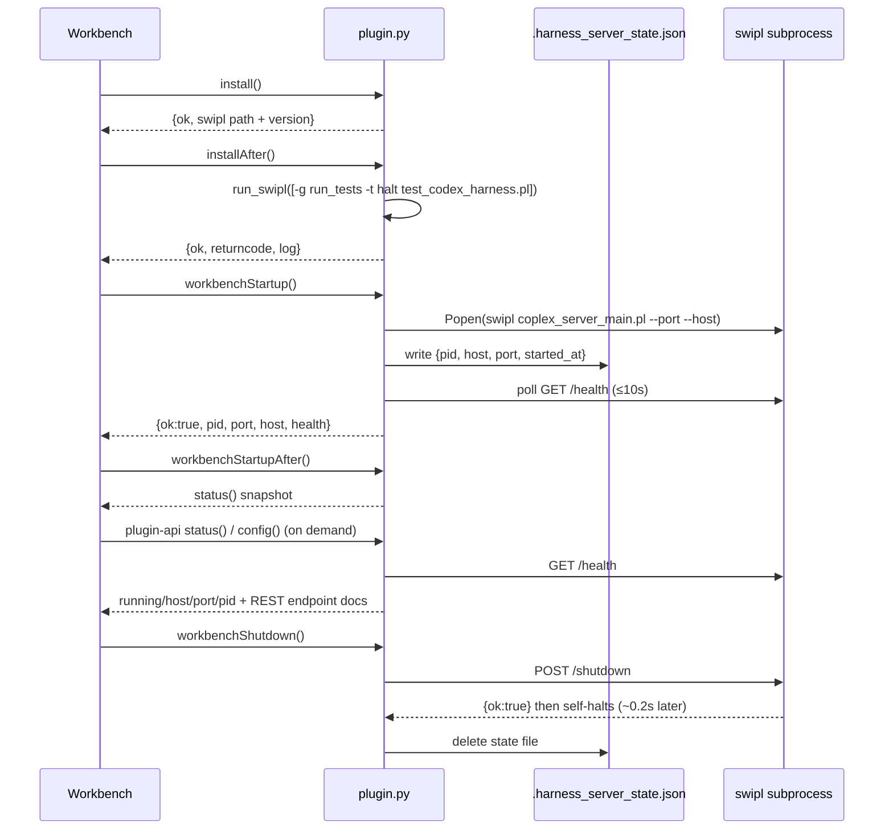

# 05 — Plugin Integration (`plugin.json` + `plugin.py`)

## Why this layer exists

Neither `codex_harness.pl` nor `coplex_server.pl` know they're
being run by a host application ("the workbench"). `plugin.py` is the
adapter between the workbench's generic plugin contract (a fixed set
of lifecycle hook names and a small admin API) and this specific
plugin's reality: a REST server that needs to be started once, health-
checked, and eventually stopped.



## Lifecycle hooks (`plugin-lifecycle.hooks` in `plugin.json`)

| Hook | Function | Behavior |
|---|---|---|
| `install` | `install()` | Verifies `swipl` is on `PATH` — the one hard requirement. Fails fast with a clear error if not. |
| `installAfter` | `install_after()` | Runs the core plunit suite (`test_codex_harness.pl`) as a post-install smoke test, so a broken checkout is caught immediately. |
| `uninstall` | `uninstall()` | Makes sure the REST server isn't left running (`stop_server()`). |
| `uninstallAfter` | `uninstall_after()` | No-op note: nothing is installed outside this plugin directory. |
| `workbenchStartup` | `workbench_startup()` | Starts the **one shared** REST server for the whole workbench session (reads `COPLEX_HOST`/`COPLEX_PORT`). |
| `workbenchStartupAfter` | `workbench_startup_after()` | Returns `status()` so the host can immediately show plugin health. |
| `workbenchShutdown` | `workbench_shutdown()` | Stops that shared server. |
| `workbenchShutdownAfter` | `workbench_shutdown_after()` | `{ok:true}`. |
| `workspaceStartup` / `...After` | no-ops | Harness instances are created on demand per caller via `POST /coplex/harnesses`, not one per workspace — there's nothing workspace-scoped to start. |
| `workspaceShutdown` / `...After` | no-ops | Same reasoning. |

Every hook function returns a small JSON-able dict with at least an
`"ok"` key rather than raising — the exact host-side error-handling
convention isn't something this plugin can verify, so it always
degrades to a structured `{"ok": false, "error": "..."}` instead of an
uncaught exception.

## Plugin API (`plugin-api` in `plugin.json`)

| Name | Function | Purpose |
|---|---|---|
| `status` | `status()` | Everything needed to decide if the plugin is usable right now: swipl path/version, server running/pid/host/port, live `/health` response, computed `base_url`. |
| `config` | `config()` | Describes the full REST endpoint list, the async-run/list-summary UI contract, the CORS env var, and the safe `harness_new/2` option subset — meant to back a host settings/docs UI. |
| `restart` | `restart()` | `stop_server()` then `start_server()` with the same host/port resolution as `workbench_startup()`. |
| `shutdown` | `shutdown()` | `stop_server()`. |

## Process supervision details (`plugin.py`)

### Starting

`start_server(port, host)`:

1. Short-circuits if `server_status()` already reports `running` (idempotent).
2. Resolves `swipl` via `shutil.which`; fails clearly if absent.
3. `subprocess.Popen([swipl, coplex_server_main.pl, f"--port={port}", f"--host={host}"])`
   with stdio redirected to `DEVNULL` and, on Windows,
   `CREATE_NEW_PROCESS_GROUP` so the child isn't tied to the parent's
   console/signal group.
4. Immediately writes `{pid, host, port, started_at}` to
   `.harness_server_state.json` next to `plugin.py`.
5. Polls `GET http://host:port/health` every 0.2s for up to 10s
   (`START_TIMEOUT_SECONDS`), also checking `proc.poll()` so a process
   that exits early is reported as a clean failure rather than a silent
   hang.

### Stopping

`stop_server(timeout=5.0)`:

1. Reads the state file; if absent, reports `{"ok": true, "was_running": false}` (idempotent).
2. `POST /shutdown` (best-effort — a dead/unreachable server is fine,
   `_http_post_json` swallows connection errors and returns `None`).
3. Polls `_pid_alive(pid)` for up to `timeout` seconds.
4. If the process is still alive after that, sends `SIGTERM`
   (POSIX) — or, since `_pid_alive` on Windows uses
   `OpenProcess`/`CloseHandle` rather than `os.kill`, this is a
   best-effort fallback rather than a guaranteed hard-kill on Windows.
5. Deletes the state file unconditionally.

### Health/status checking

`server_status()` cross-checks **two independent signals** — a live
`GET /health` response and an OS-level PID-alive check — and
self-heals the state file (deletes it) if neither indicates the
server is actually running, so a stale state file from a previous
crash doesn't cause every subsequent call to falsely report "running".

### Environment variables

| Variable | Read by | Default | Effect |
|---|---|---|---|
| `COPLEX_HOST` | `plugin.py` (`workbench_startup`, `restart`) | `localhost` | Bind host passed to the subprocess. |
| `COPLEX_PORT` | `plugin.py` (same) | `8840` | Bind port passed to the subprocess. |
| `COPLEX_CORS_ORIGIN` | `coplex_server.pl` (`configure_cors/0`, read directly by the Prolog process, not by `plugin.py`) | `*` | CORS allowlist — comma-separated origins, or `""` to disable. See [04-rest-api.md](04-rest-api.md). |

Note the asymmetry: host/port are resolved by `plugin.py` and passed
as CLI flags to the subprocess, while CORS origin is read directly by
the Prolog process from its own environment (inherited from whatever
process launched it — `plugin.py`'s `subprocess.Popen` doesn't
override the environment, so setting `COPLEX_CORS_ORIGIN` in the
workbench's own environment before it starts the plugin is sufficient).

## Manual CLI

`plugin.py` doubles as a small standalone CLI for local testing,
independent of any host application:

```
python plugin.py start      # workbench_startup()
python plugin.py stop       # workbench_shutdown()
python plugin.py status     # status()
python plugin.py restart    # restart()
python plugin.py install    # install()
python plugin.py install-after  # install_after() — runs the plunit suite
python plugin.py config     # config()
```

Every command prints its result dict as pretty-printed JSON
(`json.dumps(fn(), indent=2, default=str)`), so it composes easily
with `jq` or a quick manual smoke test.

## `plugin.json` anatomy (non-lifecycle parts)

- `"kind": "custom"`, `"entrypoint": "plugin.py"` — tells the host how
  to load this plugin at all.
- `"plugin-install.files"` — the exact file list that must be present
  for the plugin to be considered installed (all six `.pl` files plus
  `plugin.py` implicitly via `entrypoint`).
- `"ui.pages"` — declares two documentation pages (this repo's
  `README.md` and `FEATURE_GUIDE.md`, rendered by the host's docs
  viewer) and two "configure" shortcuts straight to the two most
  commonly edited source files (`codex_harness.pl`,
  `coplex_server.pl`). This `docs/` folder is not yet wired
  into `ui.pages` — add an entry here if the host should surface it
  directly rather than only via the repo file tree.
