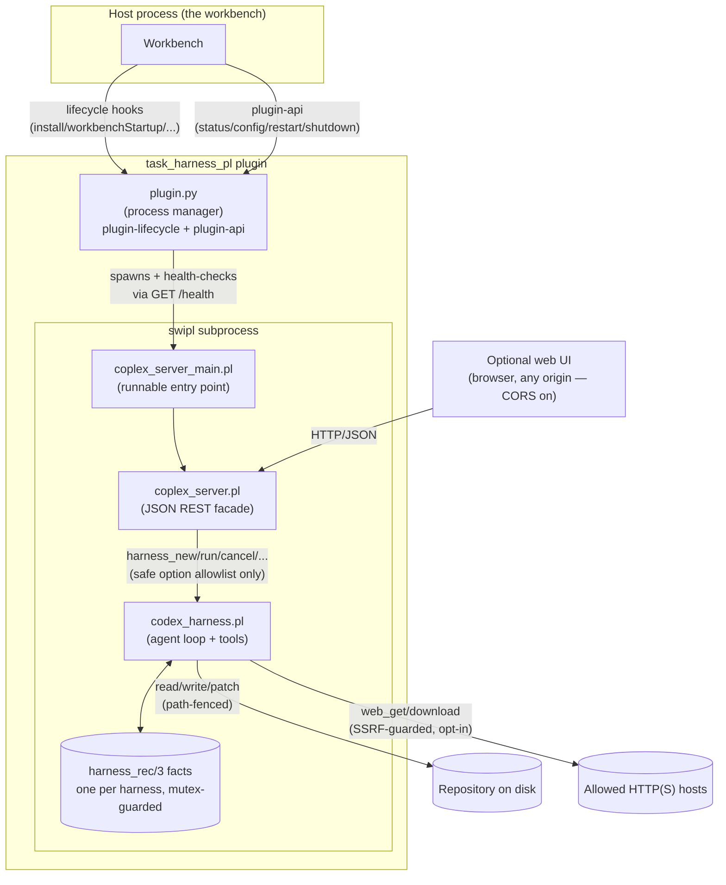

# task_harness_pl — Design Documentation

This folder is the deep-dive design reference for `task_harness_pl`: a
Codex/Copilot-style coding-agent harness implemented entirely in
SWI-Prolog, exposed over a JSON REST API, and supervised as a
subprocess by a small Python process manager. For a quickstart and the
public predicate/API summary, see `../README.md`. For extension points
and known pitfalls, see `../FEATURE_GUIDE.md`. This folder explains
*how the whole system fits together and why it's built this way*.

## Reading order

| # | Doc | Covers |
|---|-----|--------|
| 1 | [01-architecture.md](01-architecture.md) | The three layers (core engine, REST facade, process manager), how they're wired together, and the concurrency/persistence model. |
| 2 | [02-harness-core.md](02-harness-core.md) | `codex_harness.pl` internals: the harness state dict, the agent loop, sync vs. async runs, adapters, and repeat-failure detection. |
| 3 | [03-tools-and-permissions.md](03-tools-and-permissions.md) | The built-in tool catalog and the layered permission/security model (path safety, shell gating, SSRF protection, subagents). |
| 4 | [04-rest-api.md](04-rest-api.md) | `coplex_server.pl`'s full REST surface, the async-run/list-summary contract a UI is meant to drive, and REST-layer security. |
| 5 | [05-plugin-integration.md](05-plugin-integration.md) | `plugin.json` + `plugin.py`: lifecycle hooks, subprocess supervision, environment variables, and the manual CLI. |
| 6 | [06-testing.md](06-testing.md) | The two plunit test suites, what each test actually protects against, and how to run them. |

## Learning this by doing it: the curriculum track

If you want to understand *how Codex/Copilot-style coding agents work
in general* -- not just how this specific codebase is laid out -- see
[`curriculum/README.md`](curriculum/README.md): a hands-on teaching
track (no API key required) covering the agent loop, tool calling,
file editing, planning/todo tracking, MCP, and multi-agent
orchestration, with every concept tied to real, runnable code in this
repository.

## One-paragraph mental model

A **harness** is a single Prolog object term `codex_harness(Id)` whose
mutable state lives in a mutex-guarded dynamic fact
(`harness_rec(Id, Mutex, StateDict)`) — there is no database, no
external process per harness, and no persistence across a restart
(beyond an optional JSONL transcript). Driving a harness means calling
`harness_run/4` (or its non-blocking sibling `harness_run_async/3`),
which repeatedly asks a pluggable **adapter** goal for the next model
response and executes any requested **tools** (file I/O, search,
patch, shell, git, network, or nested **subagents**) against the
repository, feeding results back in until the model returns no more
tool calls or a limit is hit. Everything above is usable purely
in-process from Prolog; `coplex_server.pl` additionally exposes
it as a small stateless JSON REST facade so a host process (or a
browser-based web UI) can drive it over HTTP without embedding
SWI-Prolog, and `plugin.py` supervises that REST server as a
background subprocess on behalf of the wider workbench.

## System at a glance

Three independent layers, each documented separately, each replaceable
without touching the others:

1. **Core engine** (`codex_harness.pl`) — pure Prolog library, no
   networking, no subprocess management. Usable standalone from any
   SWI-Prolog script (see `example_codex_harness.pl`).
2. **REST facade** (`coplex_server.pl` +
   `coplex_server_main.pl`) — a thin, security-conscious JSON
   translation layer over the core engine's public predicates. Loading
   the library file never starts a server; only the `_main.pl` entry
   point does.
3. **Process manager** (`plugin.py` + `plugin.json`) — supervises the
   REST server as a background `swipl` subprocess on behalf of a
   larger host application, exposing start/stop/health/config as a
   small plugin contract.
