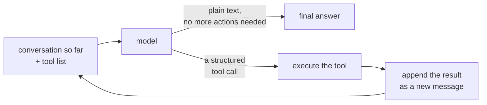

# 1. What Is a Coding Agent?

## From chatbot to agent

A chatbot takes text in, produces text out. That's it -- the
conversation is the whole product.

A **coding agent** does one thing more: partway through answering, it
can say "before I answer, I need to *do* something" -- read a file,
run the tests, search the repo, edit some code -- look at what
happened, and then decide what to do next. It keeps doing this,
turn after turn, until it's satisfied it has a real answer instead of
a guess.

That request-do-observe cycle, repeated until done, is called the
**agent loop**. It's the same shape whether you're looking at GitHub
Copilot's coding agent, OpenAI's Codex CLI, Anthropic's Claude Code, or
this repository's `codex_harness.pl` -- different products, different
model providers, same loop:

## Where this pattern comes from

The academic name for "let the model interleave reasoning with
actions and observe the results" is **ReAct** (Yao et al., *"ReAct:
Synergizing Reasoning and Acting in Language Models"*, arXiv:2210.03629,
2022). The early versions of this idea had the model free-write things
like `Action: read_file("main.py")` in plain text, which the host
program then had to regex out of the response -- fragile, and easy to
get subtly wrong.

Model providers productized this a couple of years later as **tool
calling** / **function calling**: instead of free text, the provider
trains the model to emit a strict, schema-conformant JSON object
naming a function and its arguments. The host gets guaranteed-parseable
structure instead of a string to regex. Everything downstream in this
codebase -- the `tool_calls` list in a model reply, the `{id, name,
arguments}` shape -- is exactly that JSON-tool-call convention.

## The one fact that explains most of the design

The model **never touches the filesystem, the network, or a shell
directly.** It only ever emits a JSON object *describing* an action it
would like taken. A separate, ordinary (non-LLM) Prolog program reads
that JSON and decides what actually happens.

That's it -- that's the whole trick. Everything else in this codebase
(the tool dispatch table, the option checks, and so on) is just that
one idea implemented carefully. We'll look at exactly how in later
lessons, but it's worth internalizing now, because it's *why* the loop
has the shape it does: the model's output is always just a proposal;
some other piece of code is always the one that acts on it.

## Where this lives in the code

The entire loop above is implemented in about 30 lines:
`run_loop/4` and `loop_steps/4` in `prolog/coplex/codex_harness.pl`.
Open that file next to this lesson and find them -- you'll see:

- `call_model(Id, Opts, Reply)` -- the "ask the model" step.
- `Calls == []` -- the "plain text, no more actions" exit.
- `maplist(run_one_tool(Id), Calls, Results)` -- the "execute the
  tool(s)" step (a turn can request more than one call).
- `mutate(Id, add_message(...))` -- the "append the result" step,
  once for the model's own reply and once per tool result.
- `loop_steps(Id, Opts, Next, Answer)` -- the "go again" recursive
  call.

That's the whole agent loop. Everything else in the module -- tools,
adapters, permissions, subagents -- exists to support one iteration of
that loop safely and usefully. Lesson 2 walks through a single
iteration in complete, literal detail.

## Checkpoint

Before moving on, make sure you can answer these (no grading, just
comprehension):

1. What's the difference between the model returning `content` with
   `tool_calls: []` versus `tool_calls: [...]`?
2. Why is it significant that the model only ever emits *JSON describing
   an action*, rather than running the action itself?
3. Where does the "next" conversation turn's input come from, given
   that the model has no memory of its own between calls?
