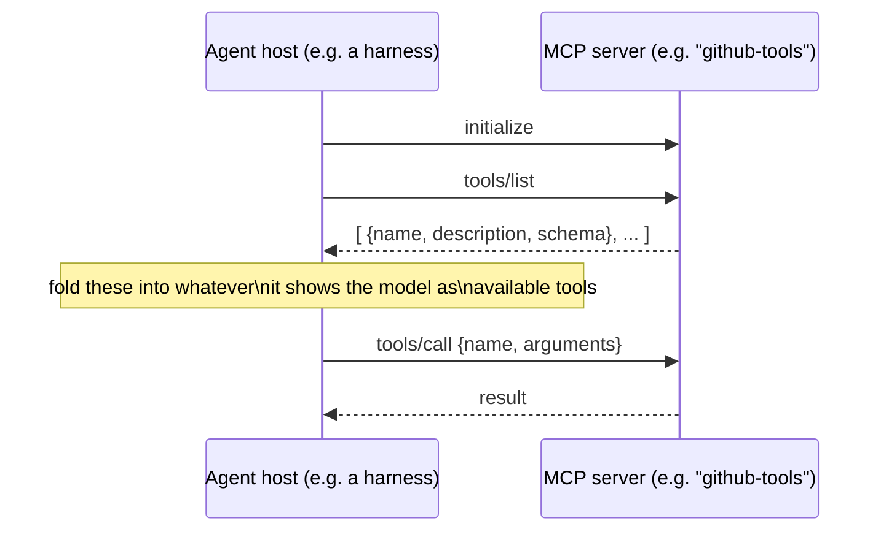

# 6. MCP and External Tools

## The idea

Every tool this harness offers -- `read_file`, `apply_patch`,
`shell`, and so on -- is written in Prolog, in this repository, and
compiled into `dispatch_tool/5`. That's simple, but it means adding a
new capability (say, "query our internal ticket tracker") requires
writing Prolog and shipping a new version of the harness.

**MCP (Model Context Protocol)** is an open protocol -- originated at
Anthropic, now used broadly across the industry -- that solves this a
different way: instead of a fixed, compiled-in tool table, an
MCP-aware host *discovers* tools at runtime by talking to one or more
separate **MCP servers**. Roughly:

A server can run locally as a subprocess (talking JSON-RPC over
stdin/stdout) or remotely over HTTP. Either way, the host doesn't need
to know anything about a tool ahead of time -- it just asks "what do
you have?" and shows the model whatever comes back, then forwards
whichever call the model makes to the right server.

## The parallel you already know

This is the exact same shape as this harness's **adapter** contract
(Lesson 9), just one layer over: an adapter lets you swap *which model
answers* without changing the loop; MCP lets you swap *which tools
exist* without changing the loop. Both are the same trick -- a stable
interface in the middle, a pluggable implementation behind it.

## What it trades off

This harness's `dispatch_tool/5` is a small, fixed, closed table: the
complete list of things that could possibly run is right there in one
file, decided in advance. An MCP-based design is the opposite --
open-ended by design: whatever tools your configured servers happen to
expose *this session* are what's available, which is enormously more
flexible (anyone can ship a server, any host can use it, no
per-integration code) at the cost of that list no longer being fixed
or fully knowable ahead of time. Neither approach is "the right one" --
it's a straightforward flexibility-vs-fixed-scope trade, worth noticing
rather than agonizing over.

## Sketch: how you'd bolt this onto `coplex`

Not implemented here -- this is a design sketch for anyone who wants
to take it further, in the same spirit as the other "documented, not
yet done" extension points in `FEATURE_GUIDE.md`:

1. A new `mcp_client.pl` module that speaks the protocol
   (`initialize`, `tools/list`, `tools/call`) over stdio to one or more
   configured server commands.
2. At harness creation, query each configured server's `tools/list`
   and fold the results into `harness_tool_specs/1`'s output, with
   names namespaced by server (e.g. `mcp_github_search`) so the model
   -- and your logs -- can always tell an MCP-sourced tool from a
   built-in one at a glance.
3. One new, ordinary `dispatch_tool/5` clause: names matching the
   `mcp_*` convention route to `mcp_client:call/3` instead of a local
   `tool_*/3` predicate. Which servers exist at all is still just
   another harness option (`mcp_servers([...])`), the same way
   `allowed_hosts` already lists which network hosts are reachable --
   configured up front, not something a model can invent.

## Discussion

1. If two different MCP servers both happened to expose a tool named
   `read_file`, how would you tell them apart in the transcript?
2. What would break in *this* harness's security story (see
   [`../03-tools-and-permissions.md`](../03-tools-and-permissions.md))
   if tool names arriving from JSON were used to look up an MCP
   server dynamically, instead of being restricted to a fixed
   `mcp_*` routing rule decided in advance?
3. Where else in this codebase have you already seen "a fixed
   allowlist of external resources, configured up front" as the
   pattern for letting an agent reach outside itself safely?
