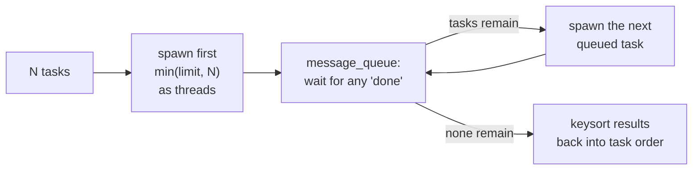

# 10. Subagents and Orchestration

## Why fan out at all

Some tasks aren't really one conversation -- they're several
*independent* small questions bundled together: "summarize each of
these five files," "check whether any of these three modules import a
deprecated API." Doing that inside one loop means burning turn after
turn on unrelated sub-questions sequentially. The `subagents` tool
instead spins up one small, independent child harness **per task**,
runs them concurrently, and collects all their answers.

## Try it

```prolog
?- [prolog/coplex/codex_harness].
?- harness_new(
     [ root('.'), adapter(scripted),
       mock_replies([_{content:"child analysis done", tool_calls:[]}])
     ], H),
   harness_tool(H, subagents,
                _{tasks:["look at file A", "look at file B", "look at file C"]},
                Result).
```

Each of the three tasks gets its own child `codex_harness(ChildId)` --
its own UUID, its own conversation, its own single-turn run -- and
`Result.results` comes back as a list of `{ok, id, task, answer,
messages}` dicts, **in the same order the tasks were given**, even
though the children ran concurrently and could finish in any order.

## The concurrency pattern underneath

This is a small, clean example of a **worker pool**, a pattern you'll
meet again outside Prolog: bound the number of things running at once
(`subagent_limit`, default 4), coordinate through a queue instead of
shared mutable variables, and keep the pool saturated as tasks finish:



- **Why a message queue, not shared state?** Each child thread simply
  `thread_send_message`s `done(Index, Result, ThreadId)` when it
  finishes; the parent thread is the only one reading and reacting to
  those messages. No two threads ever touch the same mutable variable,
  so there's nothing to lock beyond what each independent
  `codex_harness(ChildId)` already protects with its own mutex (see
  [`../01-architecture.md`](../01-architecture.md) for that mechanism).
- **Why `keysort/2` at the end?** Completion order is whatever order
  the OS schedules the threads in -- not necessarily the order tasks
  were submitted. Every result is tagged with its original task index
  before being queued, so `keysort/2` can always restore the order the
  caller expects, regardless of which child happened to finish first.

## One default worth knowing

Child harnesses default to a **read-only** tool allowlist
(`read_file`, `list_files`, `search`, `file_info`, the four read-only
git tools) -- plain concurrency hygiene, not a security posture: if
several children could write to the same files at once you'd get a
race, the same way any two threads writing the same variable would.
Set `subagent_allow_writes(true)` on the parent if you're fine with
that trade-off for your use case; children then get `all`.

## Checkpoint

1. If `subagent_limit` is 2 and you submit 5 tasks, how many child
   harnesses exist *at any one instant* during the run?
2. Why does the parent tag each task with its index *before* spawning,
   rather than after the results come back?
3. What would go wrong if two children with write access both edited
   the same file at the same time -- and how does the read-only
   default sidestep that without needing a lock?
